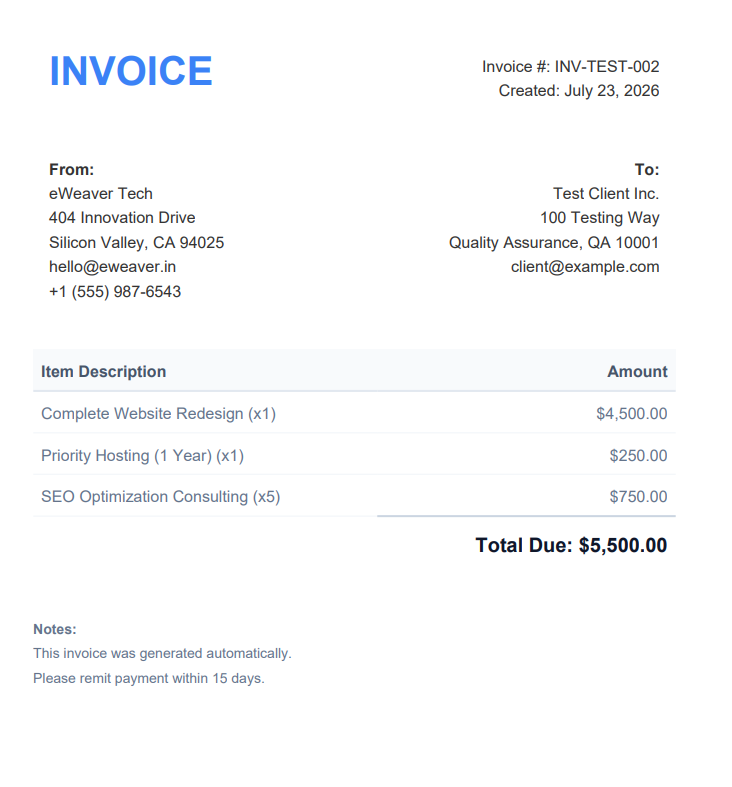
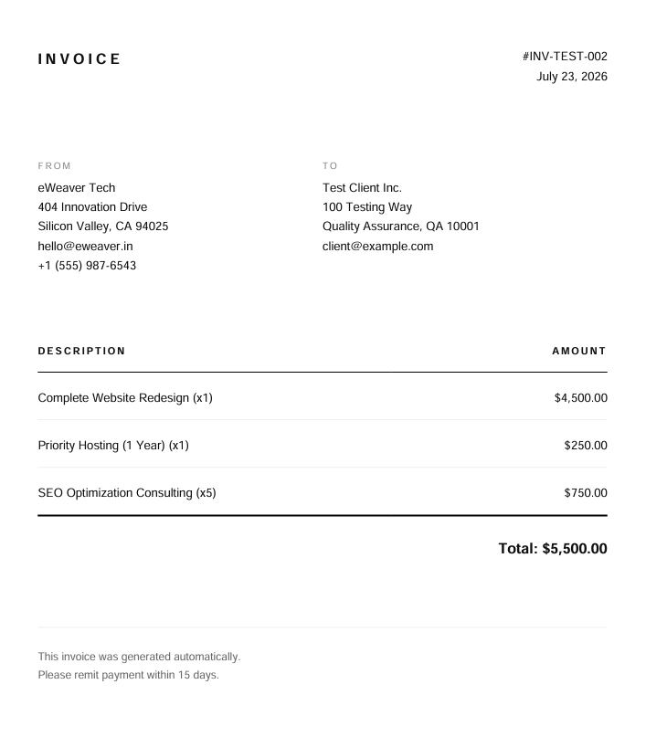
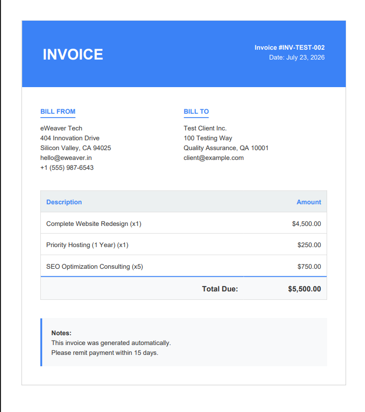
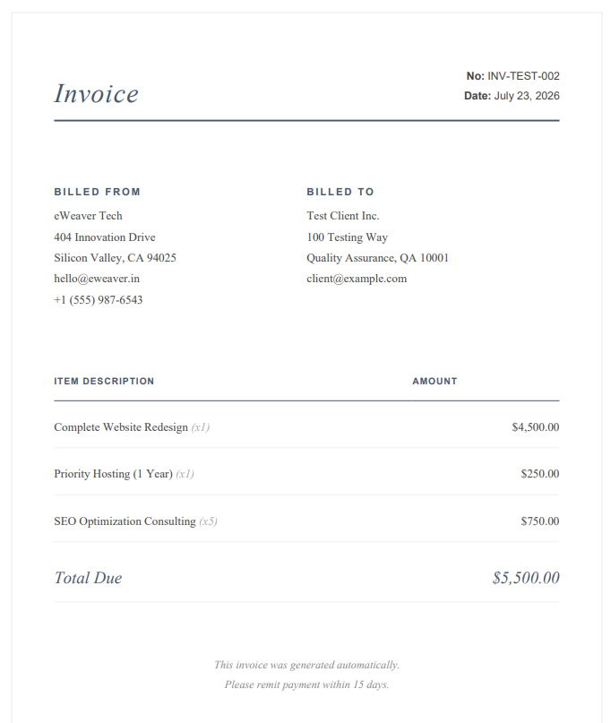
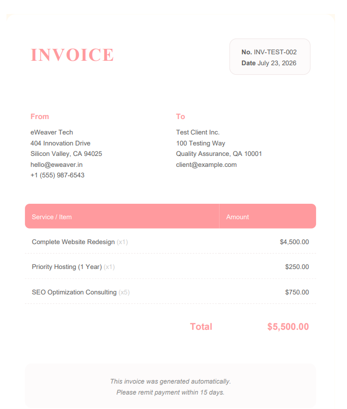

# Fluent Invoice PHP

A lightweight, beautiful, and highly fluent PHP wrapper around `dompdf` that makes generating professional PDF invoices a one-liner.

## Why use this?

Generating PDFs in PHP is traditionally painful, requiring verbose configuration and ugly HTML concatenations. This library provides a clean, modern, and fluent API to generate beautiful invoices instantly.

## Installation

```bash
composer require e-weaver/fluent-invoice-php
```

## Usage

```php
use Eweaver\FluentInvoice\Invoice;

Invoice::make('INV-1023')
    ->template('minimal') // Choose from: default, minimal, corporate, elegant, creative
    ->from([
        'eWeaver Tech',
        '123 Developer Lane',
        'Tech City, TC 90210',
        'hello@eweaver.in'
    ])
    ->to([
        'Acme Corp',
        '456 Business Blvd',
        'Corporate Town, CT 10001',
        'billing@acme.com'
    ])
    ->addItem('Custom Web Development', 1500)
    ->addItem('Monthly SEO Retainer', 500)
    ->currency('€')
    ->logo('https://example.com/path/to/logo.png')
    ->setNotes("Thank you for your business!\nPlease pay within 15 days.")
    ->save('invoice.pdf');
```

And that's it! A beautifully formatted PDF will be saved to your specified path.

## Available Templates

You can completely change the look and feel of your invoice by simply calling the `->template('name')` method. We provide 5 highly professional templates out of the box:

### 1. `default`
A clean, modern template with a custom accent color.  


### 2. `minimal`
A stripped-down, elegant black-and-white design focused on typography and whitespace.  


### 3. `corporate`
A traditional, structured template with colored headers for formal enterprise use.  


### 4. `elegant`
A luxurious template featuring serif typography, soft borders, and colored accents.  


### 5. `creative`
A softer template featuring pastel accents and rounded styling elements.  


## Customizing Colors
Each template comes with its own carefully selected default primary color (e.g., `#ff9a9e` for creative, `#2c3e50` for corporate). 

However, you can override this and completely brand the invoice to your company by passing a hex code to the `->color()` method:
```php
->color('#10b981') // Overrides the default template color with Emerald Green
```

> **Tip for Notes:** You can use `\n` in the `->setNotes()` method to create multi-line notes! 
> Example: `->setNotes("Please pay within 15 days.\nBank: XYZ Bank\nAccount: 123456")`

### Auto-fill "From" Address via `.env`
If you are generating invoices for your own company, you don't need to manually pass the `->from()` array every time. You can define the following environment variables in your `.env` file, and the package will automatically populate the "From" section for you!

```env
INVOICE_FROM_NAME="eWeaver Tech"
INVOICE_FROM_STREET="123 Developer Lane"
INVOICE_FROM_CITY="Tech City, TC 90210"
INVOICE_FROM_EMAIL="hello@eweaver.in"
INVOICE_FROM_PHONE="+1 (555) 123-4567"
```

## Adding a Logo

You can easily add a logo to the top left of your invoice. The `->logo()` method accepts several formats:

**1. External URL:**
```php
->logo('https://example.com/logo.png')
```
*(Note: To use external URLs, `allow_url_fopen` must be enabled in your php.ini, which is usually the default).*

**2. Local Absolute Path (Recommended for Speed):**
```php
->logo(__DIR__ . '/assets/images/logo.png')
```

**3. Base64 Encoded Image:**
```php
$base64 = 'data:image/png;base64,' . base64_encode(file_get_contents('logo.png'));
->logo($base64)
```

## Features

- **Fluent API:** Clean, chainable methods.
- **Customizable:** Add your own logo, currency symbols, and full multi-line addresses.
- **Built-in Template:** Comes with a highly professional, modern invoice template out of the box.
- **Dompdf Engine:** Built on top of the industry-standard `dompdf` for reliable rendering.

## License

MIT License
